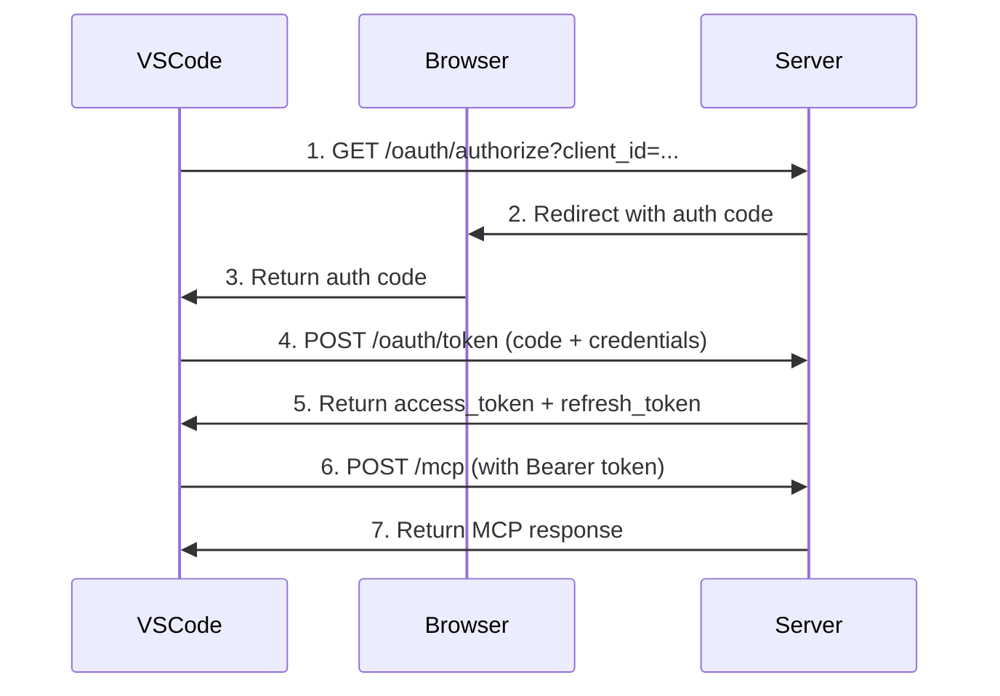

# VS Code MCP Server - OAuth2 Setup Guide

## Overview

The updated server now supports **OAuth2 authentication** for VS Code integration via HTTP transport.

## Step 1: Update Environment Variables

Edit your `.env` file:

```bash
PORT=3000
STDIO_ENABLED=true
JWT_SECRET=your-super-secret-jwt-key-change-in-production
OAUTH_CLIENT_ID=mcp-vscode-client
OAUTH_CLIENT_SECRET=mcp-secret-change-this
LOG_LEVEL=info
```

## Step 2: Rebuild and Start the Server

```bash
npm run build
npm start
```

You should see:
```
info: MCP HTTP server started {"port":3000}
info: OAuth Client Credentials: {"clientId":"mcp-vscode-client","clientSecret":"mcp-secret-change-this"}
```

## Step 3: Configure VS Code (HTTP with OAuth)

### Prerequisites for Windows

Before configuring VS Code, ensure you have:
- ✅ VS Code installed
- ✅ Node.js installed
- ✅ MCP server running (`npm start`)
- ✅ GitHub Copilot extension installed

### Option A: Using stdio (Recommended - Easiest)

**Step 1: Locate Settings File**

Press `Win+R` and paste:
```
%APPDATA%\Code\User\globalStorage\github.copilot-chat\settings
```

Press Enter. If the folder doesn't exist, create it manually:
- Right-click in `%APPDATA%\Code\User\globalStorage\`
- Create new folder: `github.copilot-chat`
- Inside it, create another folder: `settings`

**Step 2: Create Configuration File**

In the `settings` folder, create a file named `cline_mcp_settings.json` with this content:

```json
{
  "mcpServers": {
    "mcp-streaming-server": {
      "command": "node",
      "args": [
        "C:\\Users\\Ashok\\Downloads\\code_v2024-12-24 (1)\\http-streamable-mcp\\build\\index.js"
      ],
      "env": {
        "STDIO_ENABLED": "true",
        "JWT_SECRET": "your-secret-key",
        "OAUTH_CLIENT_ID": "mcp-vscode-client",
        "OAUTH_CLIENT_SECRET": "mcp-secret-change-this"
      }
    }
  }
}
```

**⚠️ Important**: Replace the path with your actual project path.

**Step 3: Reload VS Code**

1. Press `Ctrl+Shift+P`
2. Type: `Developer: Reload Window`
3. Press Enter

**Step 4: Start the Server (if not already running)**

Open PowerShell and run:
```powershell
cd "C:\Users\Ashok\Downloads\code_v2024-12-24 (1)\http-streamable-mcp"
npm run build
npm start
```

✅ Done! The MCP server should now be connected to Copilot.

---

### Option B: Using HTTP with OAuth (Advanced)

**Step 1: Locate Settings File**

Press `Win+R` and paste:
```
%APPDATA%\Code\User\globalStorage\github.copilot-chat\settings
```

**Step 2: Create Configuration File**

In the `settings` folder, create `cline_mcp_settings.json` with:

```json
{
  "mcpServers": {
    "mcp-streaming-server": {
      "url": "http://localhost:3000/mcp",
      "auth": {
        "type": "oauth2",
        "authorizationUrl": "http://localhost:3000/oauth/authorize",
        "tokenUrl": "http://localhost:3000/oauth/token",
        "clientId": "mcp-vscode-client",
        "clientSecret": "mcp-secret-change-this",
        "scope": ""
      }
    }
  }
}
```

**Step 3: Start the MCP Server**

Open PowerShell and run:
```powershell
cd "C:\Users\Ashok\Downloads\code_v2024-12-24 (1)\http-streamable-mcp"
npm run build
npm start
```

Keep this terminal open while using VS Code.

**Step 4: Reload VS Code**

1. Press `Ctrl+Shift+P`
2. Type: `Developer: Reload Window`
3. Press Enter

✅ VS Code will now authenticate via OAuth2 and connect to your MCP server.

---

### Verify Connection

After reloading VS Code:

1. Open **Copilot Chat** (Ctrl+Alt+I)
2. Look at the bottom-left corner for "MCP" or server status
3. You should see `mcp-streaming-server` connected ✅
4. Try asking Copilot a question - it should have access to your tools

If you see errors, check the troubleshooting section below.

## OAuth Client Credentials

When VS Code asks for OAuth credentials, use:

### Client ID
```
mcp-vscode-client
```

### Client Secret
```
mcp-secret-change-this
```

**⚠️ IMPORTANT**: Change these in production!

## Step 4: Test the OAuth Flow

### 1. Test Authorization Endpoint
```bash
curl "http://localhost:3000/oauth/authorize?client_id=mcp-vscode-client&redirect_uri=http://localhost:8080/callback&state=xyz&response_type=code"
```

This will redirect you to a callback URL with an authorization code.

### 2. Exchange Code for Token
```bash
# Replace YOUR_AUTH_CODE with the code from step 1
curl -X POST http://localhost:3000/oauth/token \
  -H "Content-Type: application/json" \
  -d '{
    "grant_type": "authorization_code",
    "code": "YOUR_AUTH_CODE",
    "client_id": "mcp-vscode-client",
    "client_secret": "mcp-secret-change-this"
  }'
```

Response:
```json
{
  "access_token": "eyJhbGc...",
  "token_type": "Bearer",
  "expires_in": 3600,
  "refresh_token": "abc123..."
}
```

### 3. Use Access Token
```bash
TOKEN="your_access_token_here"

curl -X POST http://localhost:3000/mcp \
  -H "Authorization: Bearer $TOKEN" \
  -H "Content-Type: application/json" \
  -d '{
    "jsonrpc": "2.0",
    "id": 1,
    "method": "tools/list"
  }'
```

## OAuth2 Endpoints

The server now provides:

| Endpoint | Purpose |
|----------|---------|
| `GET /oauth/authorize` | Authorization endpoint (gets auth code) |
| `POST /oauth/token` | Token endpoint (exchanges code for token) |
| `GET /.well-known/oauth-authorization-server` | OAuth metadata |
| `POST /mcp` | MCP endpoint (requires Bearer token) |

## OAuth2 Flow



## Supported Grant Types

1. **authorization_code** - Initial authentication
2. **refresh_token** - Refresh expired access tokens

## PKCE Support

The server supports **PKCE** (Proof Key for Code Exchange) for enhanced security:

```bash
# 1. Generate code_verifier and code_challenge
CODE_VERIFIER=$(openssl rand -base64 32 | tr -d '=' | tr '+/' '-_')
CODE_CHALLENGE=$(echo -n "$CODE_VERIFIER" | openssl dgst -sha256 -binary | base64 | tr -d '=' | tr '+/' '-_')

# 2. Authorize with code_challenge
curl "http://localhost:3000/oauth/authorize?client_id=mcp-vscode-client&redirect_uri=http://localhost:8080/callback&state=xyz&code_challenge=$CODE_CHALLENGE&code_challenge_method=S256"

# 3. Exchange code with code_verifier
curl -X POST http://localhost:3000/oauth/token \
  -H "Content-Type: application/json" \
  -d "{
    \"grant_type\": \"authorization_code\",
    \"code\": \"YOUR_CODE\",
    \"client_id\": \"mcp-vscode-client\",
    \"client_secret\": \"mcp-secret-change-this\",
    \"code_verifier\": \"$CODE_VERIFIER\"
  }"
```

## Token Lifetimes

- **Access Token**: 1 hour
- **Refresh Token**: 30 days
- **Authorization Code**: 10 minutes

## Troubleshooting

### "Invalid Client" Error
- Check that `OAUTH_CLIENT_ID` matches in both server and VS Code config
- Verify `OAUTH_CLIENT_SECRET` is correct

### "Invalid Grant" Error
- Authorization code may have expired (10 minutes)
- Code may have already been used (one-time use)
- PKCE verification failed

### VS Code Not Connecting
1. Check server is running: `curl http://localhost:3000/health`
2. Verify OAuth endpoints: `curl http://localhost:3000/.well-known/oauth-authorization-server`
3. Check VS Code logs: View → Output → Select "Claude Dev"
4. Try stdio mode instead (simpler for local development)

### Token Expired
Use the refresh token to get a new access token:

```bash
curl -X POST http://localhost:3000/oauth/token \
  -H "Content-Type: application/json" \
  -d '{
    "grant_type": "refresh_token",
    "refresh_token": "YOUR_REFRESH_TOKEN",
    "client_id": "mcp-vscode-client",
    "client_secret": "mcp-secret-change-this"
  }'
```

## Production Considerations

⚠️ **Before deploying to production:**

1. **Change Secrets**:
   - Generate strong `OAUTH_CLIENT_SECRET`
   - Use strong `JWT_SECRET`

2. **Use Real Database**:
   - Replace in-memory Maps with Redis/PostgreSQL
   - Current implementation loses tokens on restart

3. **Add User Authentication**:
   - The `/oauth/authorize` endpoint needs real login UI
   - Currently auto-generates users

4. **Enable HTTPS**:
   - OAuth2 requires HTTPS in production
   - Use reverse proxy (nginx) or Let's Encrypt

5. **Add Rate Limiting**:
   - Protect token endpoint from brute force
   - Limit authorization attempts

6. **Implement Token Rotation**:
   - Rotate refresh tokens on use
   - Revoke compromised tokens

## Quick Start Commands

```bash
# 1. Update environment
cp .env.example .env
# Edit .env with your secrets

# 2. Rebuild
npm run build

# 3. Start server
npm start

# 4. In VS Code: Add to cline_mcp_settings.json
# Use Client ID: mcp-vscode-client
# Use Client Secret: mcp-secret-change-this

# 5. Reload VS Code
# Cmd+Shift+P → "Developer: Reload Window"
```

## Summary

✅ OAuth2 client credentials: `mcp-vscode-client` / `mcp-secret-change-this`  
✅ Authorization endpoint: `http://localhost:3000/oauth/authorize`  
✅ Token endpoint: `http://localhost:3000/oauth/token`  
✅ Supports PKCE for enhanced security  
✅ Access tokens valid for 1 hour  
✅ Refresh tokens valid for 30 days  
✅ **Recommended**: Use stdio mode for local development (simpler)